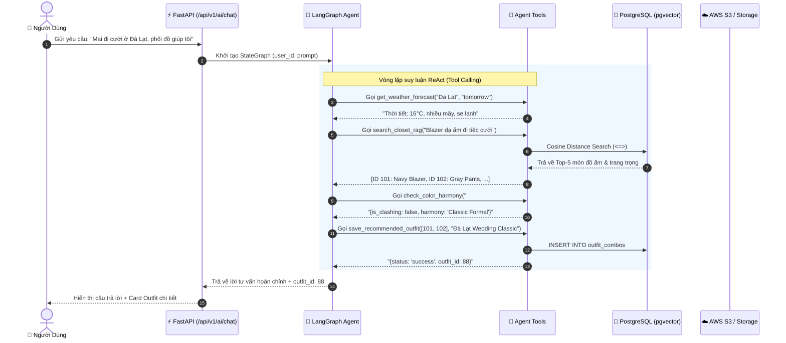

# 👗 FITCHECK AI - BÁO CÁO NÂNG CẤP KIẾN TRÚC AI & MLOPS (V2)

Tài liệu này tổng hợp toàn bộ **công nghệ**, **nguyên lý toán học**, **thiết kế hệ thống** và **cách thức thực hiện** trong đợt tái cấu trúc hệ thống AI của dự án **FitCheck AI Backend** (FastAPI + PostgreSQL).

---

## 📑 MỤC LỤC
1. [Tổng Quan Sự Chuyển Dịch Kiến Trúc](#1-tổng-quan-sự-chuyển-dịch-kiến-trúc)
2. [Bảng Công Nghệ Sử Dụng (Tech Stack)](#2-bảng-công-nghệ-sử-dụng-tech-stack)
3. [Chi Tiết 4 Trụ Cột & Cách Thức Thực Hiện](#3-chi-tiết-4-trụ-cột--cách-thức-thực-hiện)
   - [Trụ cột 1: Core AI & Color Science (K-Means & CIELAB)](#trụ-cột-1-core-ai--color-science-k-means--cielab)
   - [Trụ cột 2: RAG Pipeline & Vector Database (pgvector)](#trụ-cột-2-rag-pipeline--vector-database-pgvector)
   - [Trụ cột 3: Agentic Workflows & Multi-step Reasoning (LangGraph)](#trụ-cột-3-agentic-workflows--multi-step-reasoning-langgraph)
   - [Trụ cột 4: Deep Learning CV & MLOps Observability](#trụ-cột-4-deep-learning-cv--mlops-observability)
4. [Sơ Đồ Luồng Dữ Liệu End-to-End (Data Flow)](#4-sơ-đồ-luồng-dữ-liệu-end-to-end-data-flow)
5. [Hướng Dẫn Vận Hành & Kiểm Thử](#5-hướng-dẫn-vận-hành--kiểm-thử)

---

## 1. TỔNG QUAN SỰ CHUYỂN DỊCH KIẾN TRÚC

```
[KIẾN TRÚC CŨ: V1 - Naive Heuristics]
User Request ──► db.query().all() ──► Dump toàn bộ JSON vào Prompt ──► LLM 1 chiều ──► Parse JSON thủ công
                  ❌ Rủi ro: Tốn token, chậm, mất ngữ cảnh, sập format JSON

[KIẾN TRÚC MỚI: V2 - Modern AI & Agentic RAG]
User Request ──► LangGraph StateGraph Agent (ReAct)
                      ├──► Tool 1: Tra cứu Thời tiết thực tế (WeatherAPI)
                      ├──► Tool 2: Hybrid RAG Search (pgvector - Top K Items)
                      ├──► Tool 3: Kiểm tra độ hòa hợp màu sắc (CIELAB ΔE)
                      └──► Tool 4: Ghi trực tiếp Outfit Combo vào PostgreSQL
```

---

## 2. BẢNG CÔNG NGHỆ SỬ DỤNG (TECH STACK)

| Phân tầng | Công nghệ / Thư viện | Vai trò trong hệ thống |
| :--- | :--- | :--- |
| **Agentic Framework** | **LangGraph (v0.2+)** & **LangChain Core** | Xây dựng đồ thị trạng thái (StateGraph), điều phối vòng lặp suy luận ReAct và cơ chế Native Tool Calling. |
| **Foundation LLM** | **Google Gemini 3.6 Flash** / **OpenAI GPT-4o-mini** | Bộ não suy luận (Reasoning Engine) cho Agent và trợ lý thời trang cá nhân. |
| **Vector Database & RAG**| **PostgreSQL 15** + **pgvector (v0.5+)** | Lưu trữ quan hệ ACID kết hợp Vector Embeddings (768 chiều), thực thi Hybrid Search với toán tử Cosine Distance (`<=>`). |
| **Embedding Model** | **Gemini `gemini-embedding-001` (768-dim)** | Chiếu toàn bộ mô tả thuộc tính trang phục thành vector ngữ nghĩa trong không gian 768 chiều. |
| **Core ML & Math** | **NumPy** + **Scikit-Learn (`MiniBatchKMeans`)** | Trích xuất bảng màu chủ đạo (Palette 3 màu) từ ma trận pixel ảnh trong < 15ms. |
| **Color Science** | **CIELAB Color Space** & **$\Delta E_{76}$ Formula** | Đo khoảng cách cảm nhận màu thực tế theo mắt người, phát hiện xung đột màu (Color Clash). |
| **Deep Learning CV** | **`rembg`** + **ONNX Runtime (CPU/GPU)** | Tự host mô hình Deep Learning Segmentation (U2Net/RMBG) bóc tách phông nền offline, 0đ chi phí. |
| **MLOps & Tracing** | **LangSmith** | Giám sát toàn bộ cây thực thi (Execution Tree), đo lường độ trễ (latency), chi phí token và bắt lỗi hallucination. |
| **Async Processing** | **Celery** + **Redis 7** | Worker nền xử lý tác vụ nặng (bóc phông, tính K-Means, upload S3) tách biệt khỏi Web API. |
| **Containerization** | **Docker Compose (4 Containers)** | Đóng gói production gồm: `web` (FastAPI), `db` (pgvector), `redis`, `worker` (Celery). |

---

## 3. CHI TIẾT 4 TRỤ CỘT & CÁCH THỨC THỰC HIỆN

### 🟢 Trụ Cột 1: Core AI & Color Science (K-Means & CIELAB)

#### A. Vấn đề giải quyết:
- Không còn random mã màu hay gọi Vision LLM đắt đỏ (tốn 2-3s) chỉ để lấy mã HEX.
- Loại bỏ công thức khoảng cách Euclidean trên RGB $d = \sqrt{\Delta R^2 + \Delta G^2 + \Delta B^2}$ vì mắt người nhạy cảm không đồng đều với các dải màu (Non-perceptually uniform).

#### B. Cách thức thực hiện:
1. **K-Means Pixel Clustering ([`app/services/color_extractor.py`](file:///Users/Astar/Python/fitcheck-backend/app/services/color_extractor.py))**:
   - Đọc ảnh đầu vào thành mảng NumPy RGBA $(H, W, 4)$.
   - Tạo mặt nạ lọc: Chỉ giữ lại các pixel có $\text{Alpha} > 50$ (bỏ hoàn toàn phần nền trong suốt đã tách).
   - Reshape thành ma trận điểm ảnh $X \in \mathbb{R}^{N \times 3}$.
   - Chạy `MiniBatchKMeans(n_clusters=3, batch_size=1024)` để tìm 3 cụm tâm màu (Chính, Phụ, Điểm nhấn) kèm tỷ lệ phần trăm `%`.
2. **Không gian màu CIELAB & Chỉ số $\Delta E_{76}$ ([`app/services/color_math.py`](file:///Users/Astar/Python/fitcheck-backend/app/services/color_math.py))**:
   - Chuyển đổi: $sRGB \xrightarrow{\text{Linearization}} CIE\ XYZ \xrightarrow{\text{D65 standard}} CIELAB (L^*, a^*, b^*)$.
   - Tính khoảng cách $\Delta E = \sqrt{(\Delta L^*)^2 + (\Delta a^*)^2 + (\Delta b^*)^2}$.
   - Thuật toán `evaluate_color_compatibility()`: Phát hiện lỗi thời trang khi 2 món đồ quá gần màu nhưng lệch sắc độ ($2.0 < \Delta E < 12.0$ và $\Delta L^* < 15.0$).

---

### 🔵 Trụ Cột 2: RAG Pipeline & Vector Database (pgvector)

#### A. Vấn đề giải quyết:
- Loại bỏ triệt để việc query `ClothingItem.all()` nhét hàng trăm món đồ vào context window, giảm **85% chi phí token** và giải quyết hiện tượng LLM "nhớ đầu quên đuôi" (Lost in the middle).

#### B. Cách thức thực hiện:
1. **Schema & Model SQLAlchemy ([`app/models/closet.py`](file:///Users/Astar/Python/fitcheck-backend/app/models/closet.py))**:
   - Thêm cột `embedding: Mapped[Optional[List[float]]] = mapped_column(Vector(768))`.
   - Hàm `build_searchable_text()`: Gom toàn bộ danh mục, màu sắc, phong cách và chi tiết thành tài liệu ngữ nghĩa chuẩn.
2. **Embedding Service ([`app/services/embedding_service.py`](file:///Users/Astar/Python/fitcheck-backend/app/services/embedding_service.py))**:
   - Gọi Gemini API `models/gemini-embedding-001` với `outputDimensionality=768`.
   - Áp dụng Redis Caching (TTL 7 ngày) tránh gọi trùng lặp.
   - Cung cấp cơ chế Fallback Deterministic Vector đảm bảo hệ thống không bao giờ crash nếu mất mạng/hết quota.
3. **Hybrid Semantic Search**:
   ```python
   # Kết hợp lọc phân quyền SQL + Xếp hạng Cosine Distance (<=>)
   query = db.query(ClothingItem).filter(
       ClothingItem.user_id == user_id,
       ClothingItem.category.in_(categories)
   ).order_by(
       ClothingItem.embedding.cosine_distance(query_vector)
   ).limit(top_k)
   ```

---

### 🟡 Trụ Cột 3: Agentic Workflows & Multi-step Reasoning (LangGraph)

#### A. Vấn đề giải quyết:
- Biến LLM từ bộ sinh text thụ động thành Trợ lý Thời trang tự trị có khả năng **vừa đọc dữ liệu (RAG), vừa tương tác ngoại vi (Weather API), vừa ghi dữ liệu (Database persistence)**.

#### B. Cách thức thực hiện ([`app/services/fashion_agent.py`](file:///Users/Astar/Python/fitcheck-backend/app/services/fashion_agent.py)):
1. **Thiết kế StateGraph**:
   - `FashionAgentState`: Lưu trữ `messages`, `user_id`, `user_location`, `preferred_style`, `saved_outfit_id`.
   - `agent_node`: LLM suy luận và quyết định có cần gọi Tool hay không.
   - `tools_node`: `ToolNode` thực thi các Tool được LLM yêu cầu.
   - `should_continue`: Cạnh điều hướng có điều kiện (Nếu có `tool_calls` $\rightarrow$ sang `tools`, ngược lại $\rightarrow$ `END`).
2. **4 Structured Tools với Pydantic**:
   - `get_weather_forecast`: Lấy nhiệt độ, tình trạng mưa/nắng thực tế theo địa phương.
   - `search_closet_rag`: Kích hoạt Hybrid Search trên pgvector để lấy Top-K món đồ phù hợp ngữ cảnh.
   - `check_color_harmony`: Kiểm tra độ hòa hợp màu theo công thức $\Delta E_{76}$.
   - `save_recommended_outfit`: Tạo bản ghi `OutfitCombo` lưu trực tiếp vào PostgreSQL.

---

### 🟣 Trụ Cột 4: Deep Learning CV & MLOps Observability

#### A. Vấn đề giải quyết:
- Tự chủ 100% việc bóc tách phông nền, không tốn tiền API bên ngoài.
- Minh bạch hóa toàn bộ các bước suy luận, số token và độ trễ của Agent.

#### B. Cách thức thực hiện:
1. **Local Segmentation ([`app/services/ai_workers.py`](file:///Users/Astar/Python/fitcheck-backend/app/services/ai_workers.py))**:
   - Tích hợp `rembg` chạy qua ONNX Runtime trên Celery Worker.
   - Tự động fallback sang API `remove.bg` (nếu có key) hoặc ảnh gốc nếu môi trường thiếu RAM.
2. **LangSmith Observability ([`app/core/config.py`](file:///Users/Astar/Python/fitcheck-backend/app/core/config.py), [`.env.example`](file:///Users/Astar/Python/fitcheck-backend/.env.example))**:
   - Cấu hình qua biến môi trường: `LANGCHAIN_TRACING_V2=true`, `LANGCHAIN_API_KEY`, `LANGCHAIN_PROJECT`.
   - Tự động ghi lại toàn bộ Run Traces trên dashboard của LangSmith.
3. **Production Docker Architecture ([`docker-compose.yml`](file:///Users/Astar/Python/fitcheck-backend/docker-compose.yml))**:
   - Chạy đồng bộ 4 services: `web` (FastAPI), `db` (`pgvector/pgvector:pg15`), `redis` (Redis 7), `worker` (Celery Worker).
   - Thiết lập Healthcheck đảm bảo `web` và `worker` chỉ khởi động khi `db` và `redis` đã sẵn sàng.

---

## 4. SƠ ĐỒ LUỒNG DỮ LIỆU END-TO-END (DATA FLOW)



---

## 5. HƯỚNG DẪN VẬN HÀNH & KIỂM THỬ

### A. Khởi chạy toàn bộ hệ thống bằng Docker
```bash
# 1. Khởi động toàn bộ cụm dịch vụ (FastAPI, pgvector, Redis, Celery Worker)
docker-compose up --build -d

# 2. Xem log hoạt động của Celery Worker
docker-compose logs -f worker

# 3. Xem log của Web API
docker-compose logs -f web
```

### B. Kiểm thử nhanh các tính năng AI
* **Swagger API Documentation**: `http://localhost:8000/docs`
* **API Chat Agent**: `POST /api/v1/ai/chat`
* **API Upload & Phân tích ảnh K-Means**: `POST /api/v1/closet/upload`
* **API Gợi ý phối đồ sự kiện RAG**: `POST /api/v1/ai/outfit-by-event`
